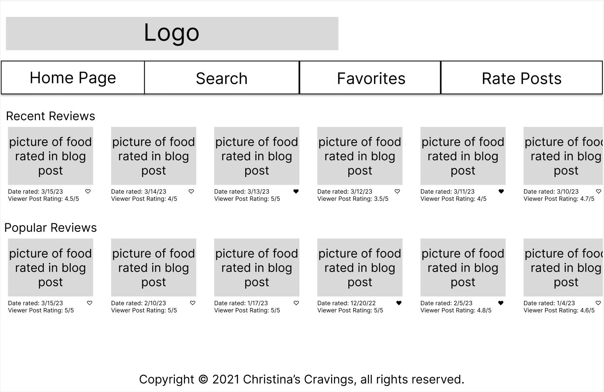
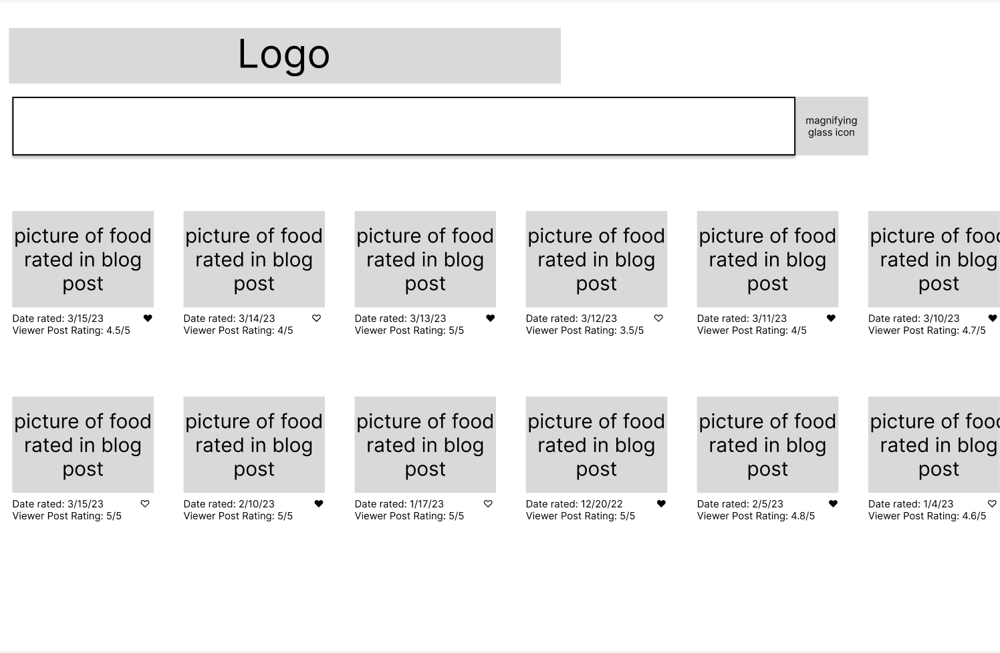
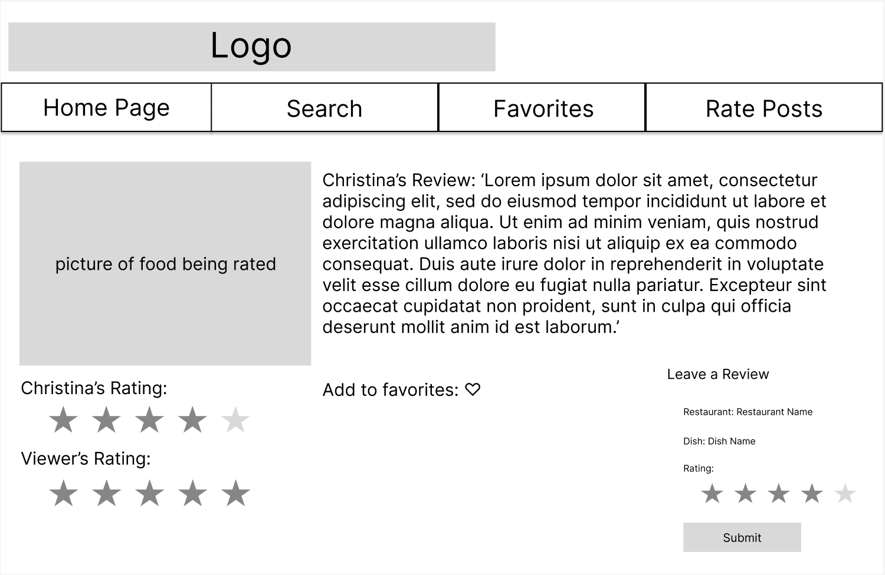
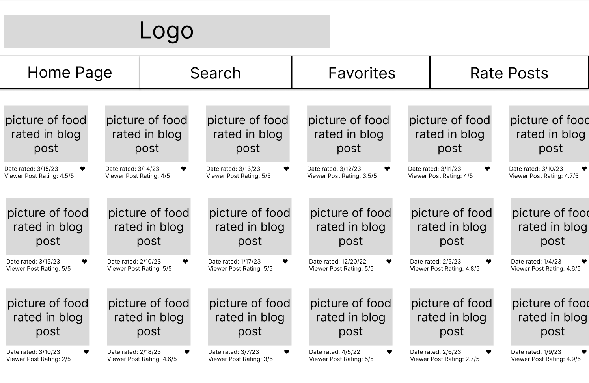
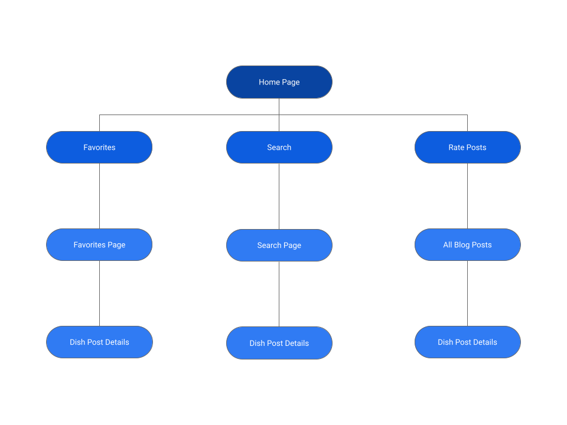
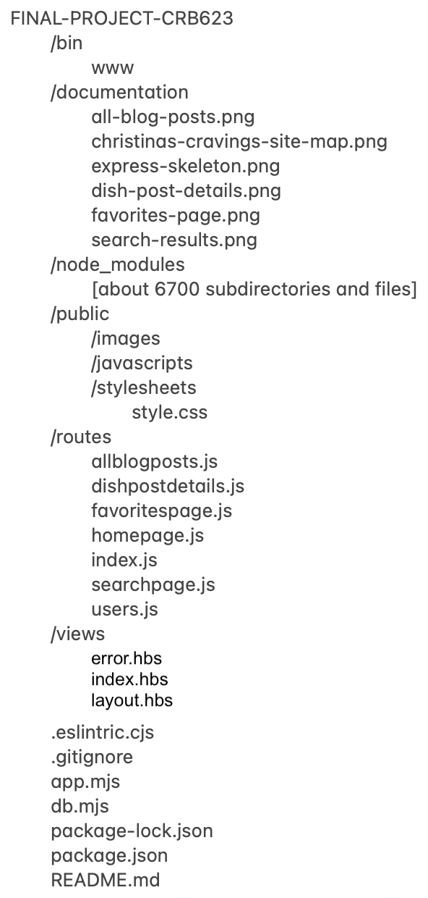

# Christina's Cravings 

## Overview
Remember craving chicken parm or drunken noodles but not knowing where to order the dish from. Christina's Cravings can help with this issue! Christina's Cavings is a web app that allows users to view food realted blog postings, that rate dishes at resturants. Users will not be requried to register or log in to use the application. 

When on the applications users will be able to search for blog posts by indicated cuisines and descriptive words, view all blog posts on Christina's Cravings, view postings in more detail, favorite posts, view all favorite posts, rate how much they like a post, and see the average rating of a blog post.

## Data Model

The application will store Users, Blog Posts, Lists and Items

* users can have multiple lists (via references)
* each list can have multiple items (by embedding)
* lists will be composed of favorited blog posts

(__TODO__: sample documents)

An Example User:

```javascript
{
  email: "aws293@gmail.com",
  hash: // a password hash,
  favorites: // an array of references to favorited blog posts
}
```

An Example List with Embedded Items:

```javascript
{
  user: // a reference to a User object
  name: "Favorites",
  items: [
    { name: "Som Bo Steak Bowl", description: "Lorem ipsum dolor sit amet, consectetur adipiscing elit. Nam eu.", rating: "4", checked: true},
    { name: "Ippudo Ramen", description: "Lorem ipsum dolor sit amet, consectetur adipiscing elit. Nam eu.", rating: "5", checked: true},
  ],
  createdAt: // timestamp
}
```


## [Link to Commented First Draft Schema](db.mjs) 

## Wireframes

/homepage - home page providing popular and recent reviews



/searchpage - search page providing posts that match the users search inputs



/allblogposts - page that shows all blog posts


/dishpostdetails - page for showing specific blog post list



/favoritespage - page for showing all posts flagged as a favorite by the user



## Site map


## User Stories or Use Cases
1. as a user, I can search for blog posts by indicated cuisines and descriptive words
2. as a user, I can view all posts made on Christina's Cravings blog
3. as a user, I can press on posts to view postings in more detail
4. as a user, I can favorite posts
5. as a user, I can view all of my favorite posts on the favorites page
6. as a user, I can rate how much I like a post
7. as a user, I can see the average rating of a blog post

## Research Topics

* (5 points) Front-End Creation with React.js
    * React.js will be used to code the front-end
    * see <code>cs.nyu.edu/~crb623/ait-final/homepage</code> for home page
* (5 points) Embedding blog posts into maps with API
    * use google api to display all blog postings on a map. I am unfamilar with the concept of Google API so this feature has been assigned 5 points

10 points total

## [Link to Initial Main Project File](app.mjs) 



## Annotations / References Used
1. [Assistance in creating skeleton Express application](https://developer.mozilla.org/en-US/docs/Learn/Server-side/Express_Nodejs/skeleton_website#running_the_skeleton_website)
2. [Assistance in creating db.mjs](https://developer.mozilla.org/en-US/docs/Learn/Server-side/Express_Nodejs/mongoose)
3. [Google Maps Platform Documentation](https://developers.google.com/maps/documentation)
4. [Learn React.js](https://react.dev/learn)